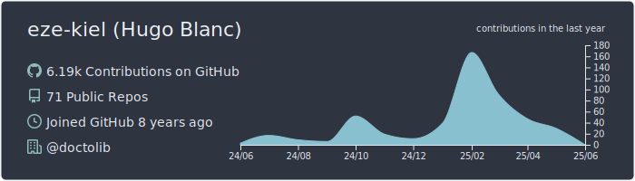
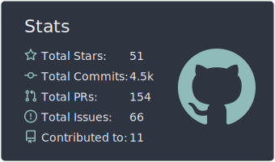
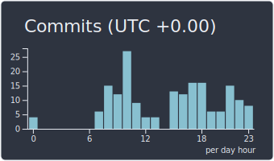

# Hello there
<!--  -->

* :office: I'm currently working @ [Virtuo](https://www.govirtuo.com/) as a Site Reliability Engineer
* :space_invader: I love security, breaking things and making containers go skrrrr
* :computer: I enjoy developing random (and mostly useless) stuff, especially in Go

<!--  
 
-->
## Might be useful

GPG public key [here](https://keybase.io/ezekiell/pgp_keys.asc)

GPG public key signature: `FF82 4115 9BA9 EE70`

## Might not be useful

🎲 Learn about recursion [here](https://github.com/eze-kiel) 

🇺🇦
