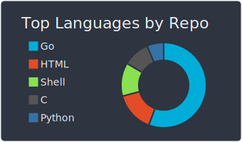

# Hello there
<!--  -->

* :office: I'm currently working @ [Virtuo](https://www.govirtuo.com/) as a Site Reliability Engineer
* :school: I also teach shell scripting, Go programming and offensive security techniques to BSc students @ [Lyon 1 Institute of Technology](https://www.univ-lyon1.fr/)
* :space_invader: I love security, breaking things and making containers go skrrrr
* :computer: I enjoy developing random (and mostly useless) stuff, especially in Go

<!--  -->
<!--  
 
-->

## My tech stack

 

## Might be useful

GPG public key: [here](https://keybase.io/ezekiell/pgp_keys.asc?fingerprint=9336656985d401fe423315e7072b3ace0fce7a75)

GPG public key signature: `072B 3ACE 0FCE 7A75`

## Might not be useful

🎲 Learn about recursion [here](https://github.com/eze-kiel) 

Because I :heart: FOSS, I'm slowly moving to [codeberg.org](https://codeberg.org/h7c) for personal projects.

🇺🇦
